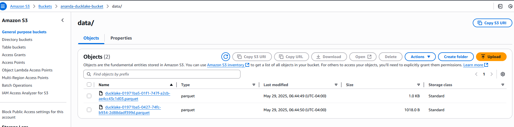

# DuckLake S3 Integration Demo

This project demonstrates how to use DuckDB with the DuckLake extension to interact with data stored in Amazon S3.

## Prerequisites

- Python >=3.9
- AWS account with S3 access
- AWS credentials (access key and secret key)

## Setup

1. Clone this repository
2. Create a `.env` file in the project root with your AWS credentials:
   ```
   AWS_ACCESS_KEY=your_access_key
   AWS_SECRET_KEY=your_secret_key
   ```
3. Run with uv:

   if you are new to uv, run below command to install uv and packages mentioned in pyproject.toml

   ```
   pip install uv
   ```
   
   ```
   run below command in project directory where in pyproject.toml is available
   
   uv pip install -e .
   ```

   ```
   uv run main.py
   ```

## Project Structure

- `main.py` - Creates an S3 bucket, sets up DuckLake, and creates sample tables
- `.env` - Environment variables for AWS credentials (not tracked in git)

## Features

### S3 Bucket Management

- Creates an S3 bucket named "ananda-ducklake-bucket" if it doesn't exist
- Creates a "data/" folder in the bucket if it doesn't exist
- Handles errors and checks for existing resources

### DuckLake Integration

- Installs and configures the DuckLake extension for DuckDB
- Creates sample tables (customer and inventory) in DuckLake
- Populates tables with sample data
- Demonstrates querying data from DuckLake tables

## Usage

Run the main script to create the S3 bucket, folder, and DuckLake tables:

```
uv run main.py
```

## S3 Bucket Contents

Below is a screenshot of the S3 bucket contents after running the script:


